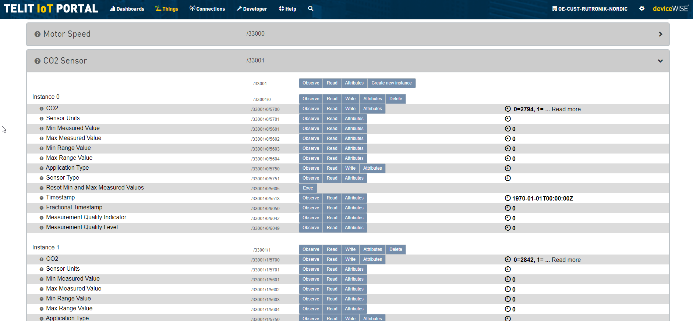
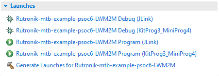

# RAB2-CO2 and RDK2 Code Example

Rutronik Development Kit Programmable System-on-Chip CY8C6245AZI-S3D72 "RDK2_LWM2M_Example" Code Example.

This code example is for the Telit's LPWA modem ME310G1-WW and Telit's [portal-dev.telit](https://portal-dev.telit.com/app/login) cloud demonstration. The unreleased Arduino shield's prototype [RUT_xE310](https://github.com/RutronikKaunas/RUT_xE310_Shield) has been used for creating this code example. Example also uses [RAB-CO2 shield](https://github.com/RutronikSystemSolutions/RDK2_RAB2-CO2_Demo) sensors for collecting the data to be sent to Telit's cloud.

## Requirements

- [ModusToolbox® software](https://www.infineon.com/cms/en/design-support/tools/sdk/modustoolbox-software/) v3.0

### Using the code example with a ModusToolbox IDE:

1. Import the project: **File** > **Import...** > **General** > **Existing Projects into Workspace** > **Next**.
2. Select the directory where **"RDK2_LWM2M_Example"** resides and click  **Finish**.
3. Update libraries using  a **"Library Manager"** tool.
4. Select and build the project **Project ** > **Build Project**.

### Operation

The firmware example uses KitProg3 Debug UART for the debug output. The results are read from the sensor and are printed on the terminal window:

Once per minute the data is sent as an AT command via UART to the modem which posts the message to the cloud via LWM2M protocol:

### Debugging

If you successfully have imported the example, the debugging configurations are already prepared to be used with a the KitProg3, MiniProg4, or J-link. Open the ModusToolbox perspective and find the Quick Panel. Click on the desired debug launch configuration and wait for the programming to  complete and debugging process to start.

## Legal Disclaimer

The evaluation board including the software is for testing purposes only and, because it has limited functions and limited resilience, is not suitable for permanent use under real conditions. If the evaluation board is nevertheless used under real conditions, this is done at one’s responsibility; any liability of Rutronik is insofar excluded. 

